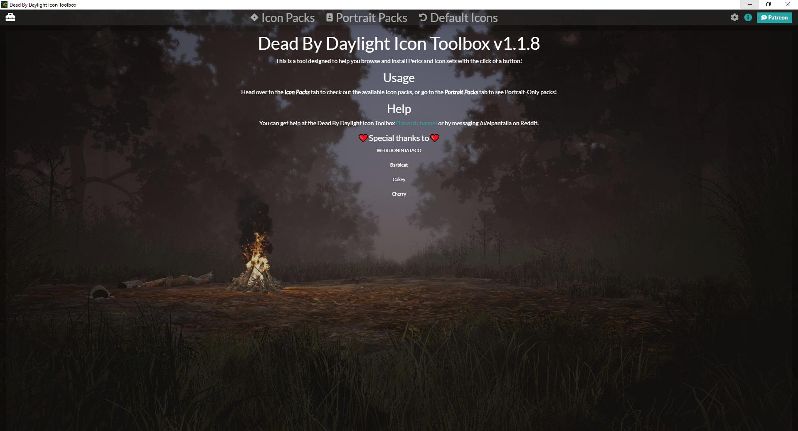
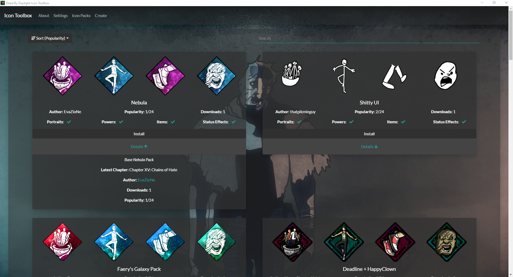
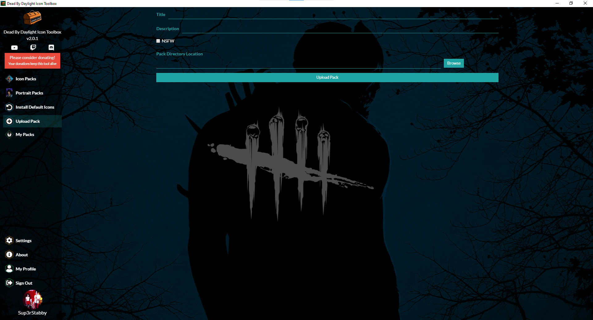

The Dead By Daylight Icon Toolbox is a desktop Windows application designed to make the process of browsing for & installing Perks (and other icons) easy. It also includes functionality to generate icon pack bundles to be included in the Perk respository. The tool will autodetect your Dead By Daylight installation location in most cases.

If you've installed Dead By Daylight from the Windows Store (why?), then you will have to set the path manually via the Settings tab.

## Why does this exist?
This exists for two reasons: I am an Embedded Developer by trade, and this was a fun opportunity to learn some webbier development while still making a useful Desktop application. That's why I chose bloated Electron over something like C#/WPF or JavaFx. The second reason is that I'm tired of unzipping icon packs and dragging them over. It's nice to have them all in one place.

## Pack Submission
In order to submit a icon pack, please contact me either on [Discord](https://discordapp.com/invite/3WexstV) or [Reddit](https://reddit.com/message/compose?to=elpantalla&subject=My+Icon+Pack) and send me the .zip. 

## Issues
This software is essentially in Beta right now, as I've not done much testing anywhere other than my local computer. Expect issues to come up...

You can report any isses to me on Discord or through the [issue tracker](https://github.com/nrcrast/DbdPerkTool/issues) on GitHub. 

## Screenshots

## Limitations/Future Dev
* No Char Portrait only packs right now. Those will be added as a new tab in the future. If you have Char Portraits included with your icon pack, that's OK though.
* Add search/filtering to pack page
* Add sorting to pack page. Currently packs are only sorted by popularity.
* Create fancier header images to show status/items as well.
* Expand/Contract Icon Packs to save space

Feel free to fork and hit me with a PR!

## Icon Credits
Credit for Application Icons and the icon at the top of this page goes to HappyClown + Yoinks. Please don't hesistate to reach out if my use of your beautiful icons is an issue!
