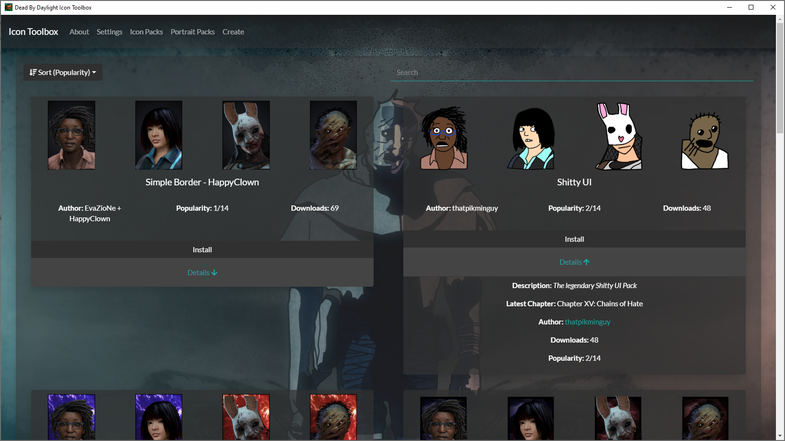

The Dead By Daylight Icon Toolbox is a desktop Windows application designed to make the process of browsing for & installing Perks (and Icons/Char Portraits) easy. It also includes functionality to generate icon pack bundles to be included in the Perk respository. The tool will autodetect your Dead By Daylight installation location in most cases.

If you've installed Dead By Daylight from the Windows Store (why?), then you will have to set the path manually via the Settings tab.

## New Features: v1.0.2
* Added new screen for Character Portrait only packs. This screen will show both packs that only contain character portraits as well as packs that contain other perks/icons as well. If a pack installed from the character portrait screen, only the character portraits will be installed, even if that pack contains other icons. To install _everything_ from a pack, install it from the "Icon Packs" area. 
* Added items/portraits/status effects to the details expansion for each icon pack. 
* Tweaked the way perk preview icons are grabbed from the server.

## Why does this exist?
This exists for two reasons: I am an Embedded Developer by trade, and this was a fun opportunity to learn some webbier development while still making a useful Desktop application. That's why I chose bloated Electron over something like C#/WPF or JavaFx. The second reason is that I'm tired of unzipping icon packs and dragging them over. It's nice to have them all in one place.

## Pack Submission
In order to submit a icon pack, please contact me either on [Discord](https://discordapp.com/invite/3WexstV) or [Reddit](https://reddit.com/message/compose?to=elpantalla&subject=My+Icon+Pack) and send me the .zip. 

## Issues
You can report any isses to me on Discord or through the [issue tracker](https://github.com/nrcrast/DbdPerkTool/issues) on GitHub. 

## Screenshots

## Limitations/Future Dev
* Create profiles for creators, more filtering options
Feel free to fork and hit me with a PR!

## Icon Credits
Credit for Application Icons and the icon at the top of this page goes to [HappyClown](https://steamcommunity.com/groups/HappyClownsColoredIcons) + [Yoinks](https://steamcommunity.com/profiles/76561198148794186/). Please don't hesistate to reach out if my use of your beautiful icons is an issue!
